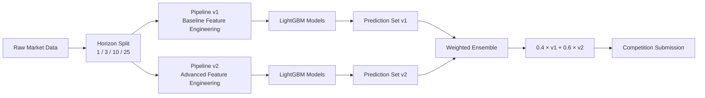

# 📈 Hedge Fund: Time Series Forecasting

> **CS116.Q23 Course Project** — University of Information Technology (UIT), VNU-HCM  
> *A full quantitative pipeline for large-scale hierarchical multi-horizon financial forecasting*

---

## 🏆 Result

**Top 34 on the Kaggle Leaderboard** — WRMSE: `0.1629`

---

## 📋 Overview

This project builds an end-to-end machine learning pipeline for the [Kaggle Hedge Fund: Time Series Forecasting](https://www.kaggle.com/) competition. The goal is to predict `y_target` — a normalized return signal — across four forecasting horizons (1, 3, 10, 25) for a large hierarchical portfolio of financial instruments.

The dataset contains **5,337,414 training samples** spanning 3,601 time steps, with **94 anonymized alpha factor features** and a hierarchical structure of `sub_category → code → sub_code`.

---


## 🔬 Pipeline Overview

### 1. Exploratory Data Analysis

- **Data space**: 5 `sub_category` groups, 23 `code` identifiers, 180 `sub_code` entities
- **Target distribution**: Standard deviation grows 4.5× from horizon 1 (σ=11.70) to horizon 25 (σ=52.82), reflecting increasing forecast uncertainty
- **Fat tails**: Kurtosis of 528 at horizon 1 — financial market shocks are far more frequent than classical statistics assume
- **Weight asymmetry**: Top 10% of samples by weight account for ~98.3% of total weight (Lorenz curve analysis)
- **Feature correlation**: Spearman IC used instead of Pearson; top features reach |IC| ≈ 0.085 at horizon 1

### 2. Data Preprocessing

- **No look-ahead bias**: All transformations follow strict *Time-Wall Integrity* — only past data is used at each prediction point
- **Missing values**: Leveraged LightGBM's native NaN handling; rolling features use `min_periods=1`; residual NaNs filled with `fillna(0)` post-feature-creation
- **Memory optimization**: Horizon-based chunking + `gc.collect()` reduced peak RAM from 4.2 GB to 2.5 GB per training run

### 3. Feature Engineering

| Feature Group | Description |
|---|---|
| **Hierarchical Target Encoding** | Historical mean/std of `y_target` per `code`, `sub_code`, `sub_category` |
| **Lag Features** | Lag1, Lag3, Lag7, Lag14 of target signal |
| **Momentum Features** | Rate-of-change ratios (e.g., `(Lag1 - Lag7) / (|Lag7| + ε)`) |
| **Frequency Encoding** | Count encoding of `(code, horizon)` interaction pairs |
| **Cyclical Time Features** | `sin/cos` encoding for 100-day and 365-day cycles |
| **Log Time** | `log(1 + ts_index)` to capture non-stationarity drift |

### 4. Modelling & Optimization

#### Why LightGBM?
- Histogram-based splitting reduces memory and training time
- Gradient-based One-Side Sampling (GOSS) focuses computation on high-gradient samples
- Leaf-wise tree growth captures complex nonlinear patterns
- Native support for sample weights (directly aligns with WRMSE objective)

#### Multi-Horizon Modelling
Each horizon (1, 3, 10, 25) is trained on a **separate LightGBM model cluster** using *Direct Multi-Step Forecasting* — preventing short-horizon noise from contaminating long-horizon learning.

#### Dual-Level Ensemble Architecture



**Multi-Seed Averaging**: Each horizon trains 5 independent LightGBM models with seeds `{42, 2024, 777, 1337, 9999}`, averaged to reduce prediction variance.

**Pipeline v2 extras**:
- *Winsorization*: clip outliers at 1st/99th percentile
- *Sign Features*: direction-only signals (±1) for stability
- *Hierarchical Z-scores*: normalize each asset relative to its `sub_category`
- *Exponential Recency Weighting*: `w(t) = exp(λ · (t - t_min) / (t_max - t_min))`, λ=2.5

#### Time-Based Cross Validation

| Split | ts_index Range |
|---|---|
| Train | 1 – 3,499 |
| Validation | 3,500 – 3,601 |
| Test (OOS) | 3,602 – 4,376 |

Early stopping (`early_stopping_rounds=50`) prevents overfitting to training noise.

### 5. Loss Function

**Weighted RMSE (WRMSE)**:

$$WRMSE = \sqrt{\frac{\sum_{i=1}^{N} w_i (y_i - \hat{y}_i)^2}{\sum_{i=1}^{N} w_i y_i^2}}$$

Sample weights are passed directly into LightGBM training to align the optimization objective with the competition scoring metric.

---

## 🛠️ Tech Stack

- **Language**: Python 3.x
- **Core libraries**: `lightgbm`, `pandas`, `numpy`, `scikit-learn`
- **Data format**: Apache Parquet (`.parquet`)
- **Visualization**: `matplotlib`, `seaborn`

---

## 🚀 Quick Start

```bash
# Install dependencies
pip install lightgbm pandas numpy scikit-learn pyarrow matplotlib seaborn

# Run the full pipeline (example)
python src/model.py --horizon 1 --seeds 42 2024 777 1337 9999
```

---

## 👤 Author

**Nguyễn Việt Hoàng** — MSSV: 24520561  
Course: CS116.Q23 — Introduction to Machine Learning  
Instructors: Ths. Nguyễn Đức Vũ, Ths. Đàm Vũ Trọng Tài  
University of Information Technology (UIT), VNU-HCM
